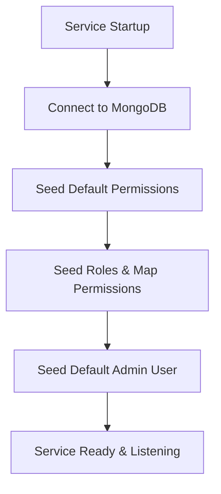

# 🔑 OrganiStation Auth Service

The **Auth Service** is a core Python FastAPI microservice responsible for identity management, user authentication, Token-based authorization, and Role-Based Access Control (RBAC) across the entire OrganiStation platform.

---

## ✨ Key Features

- **JWT Authentication**: Issues signed JSON Web Tokens (JWT) for authentication using the `HS256` algorithm.
- **Token Rotation & Security**: Implements secure token refresh mechanisms with database-backed refresh tokens and token rotation (deleting used refresh tokens to prevent replay attacks).
- **Role-Based Access Control (RBAC)**: Manages permissions and maps them to standard roles:
  - `SUPER_ADMIN` (All platform capabilities)
  - `ORG_ADMIN` (Organization administration)
  - `HR_MANAGER` (HR record management and approvals)
  - `PROJECT_MANAGER` (Project management and task delegation)
  - `FINANCE_MANAGER` (Expense approvals and payroll tracking)
  - `EMPLOYEE` (General access: profile, applying leaves, tasks)
- **Automatic Database Seeding**: On start, the service automatically seeds standard permissions, roles, and a default Super Admin user (`admin@organistation.com` / password: `Admin@123`).
- **Cascade Account Deletion**: Integrates with downstream services (HR, Project, Finance) to coordinate cascade cleanups when user profiles are deleted.
- **Secure Password Policies**: Enforces password hashing using `bcrypt` and flags new accounts to require a password change on first login.

---

## 🛠️ Technology Stack

- **Framework**: FastAPI (Python 3.10+)
- **Database**: MongoDB (via `motor` asynchronous driver)
- **Hashing**: `passlib` (with `bcrypt` backend)
- **JWT**: `python-jose`

---

## 📂 Architecture & Seeding Workflow

### 🚀 Lifespan Initialization


---

## ⚙️ Configuration & Environment Variables

Create a `.env` file in the root of the `auth-service` directory (you can copy `.env.example` as a template).

| Variable | Description | Default | Required |
| :--- | :--- | :--- | :--- |
| `PORT` | Service port | `8001` | No |
| `HOST` | Bind address | `0.0.0.0` | No |
| `MONGODB_URI` | Connection URI for MongoDB | `mongodb://localhost:27017` | Yes |
| `DB_NAME` | Database name | `organistation_auth` | No |
| `JWT_SECRET` | Secret key used for signing JWT tokens | *Secret key* | Yes (in Prod) |
| `JWT_ACCESS_EXPIRY_MINUTES` | Access token lifespan (minutes) | `15` | No |
| `JWT_REFRESH_EXPIRY_DAYS` | Refresh token lifespan (days) | `7` | No |
| `HR_SERVICE_URL` | HR microservice URL | `http://localhost:8002` | No |
| `PROJECT_SERVICE_URL` | Project microservice URL | `http://localhost:8003` | No |
| `FINANCE_SERVICE_URL` | Finance microservice URL | `http://localhost:8004` | No |
| `INTERNAL_SERVICE_SECRET` | Secret for verifying inter-service requests | *Secret* | No |

---

## 🚀 API Endpoints

### 🔑 Authentication Endpoints (`/auth`)

* **`POST /auth/login`**:
  - Validates credentials and returns JWT access & refresh tokens.
  - **Payload**:
    ```json
    {
      "email": "admin@organistation.com",
      "password": "Admin@123"
    }
    ```

* **`POST /auth/refresh`**:
  - Exchanges a valid refresh token for a new access token and a rotated refresh token.

* **`POST /auth/logout`**:
  - Revokes and removes the provided refresh token from the database.

* **`GET /auth/me`**:
  - Returns details, roles, and permissions of the currently authenticated user session.

* **`POST /auth/change-password`**:
  - Allows logged-in users to update their password. Marks `must_change_password` as `false`.

---

### 👥 User Administration Endpoints (`/users`)

* **`GET /users`**: Retrieve list of all users.
* **`POST /users`**: Create a new user profile (restricted to HR / Admin).
* **`GET /users/{id}`**: Get user profile details by ID.
* **`PUT /users/{id}`**: Update user profile status, roles, or information.
* **`DELETE /users/{id}`**: Triggers cascade delete of the user profile across all services.

---

### 🛡️ Role Management Endpoints (`/roles`)

* **`GET /roles`**: Retrieve all roles and their mapped permissions list.
* **`PUT /roles/{name}`**: Update permission list mapping for a specific role.

---

## 💻 Local Development

### 1. Setup Virtual Environment
```bash
python -m venv venv
source venv/bin/activate  # On Windows: .\venv\Scripts\activate
pip install -r requirements.txt
```

### 2. Configure MongoDB
Ensure MongoDB is running locally on port `27017` or update the `MONGODB_URI` in `.env`.

### 3. Run the Server
```bash
python src/app.py
```
The server will start at `http://localhost:8001`. You can access interactive API docs at `http://localhost:8001/docs`.

---

## 🐳 Docker Deployment

To build and run the service inside a Docker container:

```bash
# Build the Image
docker build -t organistation-auth-service .

# Run the Container
docker run -d \
  -p 8001:8001 \
  --env-file .env \
  organistation-auth-service
```
